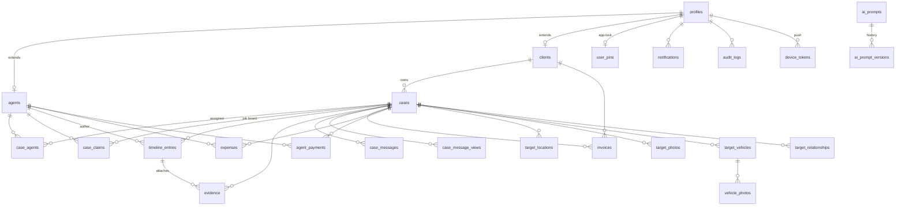
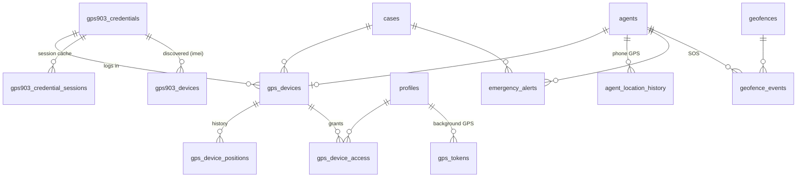

# Database Schema (Detective Pulse)

Schema overview for the PostgreSQL (Supabase) database — 35 tables in `public`,
as of migration `0087`. Generated from live introspection; regenerate the
canonical types with `supabase gen types typescript --linked --schema public`.

## Conventions

- **Identity.** `profiles.id` = `auth.users.id` (1:1). `agents` and `clients`
  each extend a profile via `profile_id`. App roles live on `profiles.role`
  (`admin` / `supervisor` / `agent` / `client`).
- **Case is the hub.** Most operational tables carry a `case_id` FK to `cases`.
- **Audit columns.** Many tables carry `created_by` / `updated_by` /
  `deleted_by` / `paid_by` / `uploaded_by` / `acknowledged_by` FKs to
  `profiles`. These are omitted from the ERD below for readability (they all
  point at `profiles`); each is covered by an index (see migration `0086`).
- **Soft delete.** `deleted_at` (+ `deleted_by`) marks soft-deleted rows on
  tables like `timeline_entries`, `evidence`, `invoices`, `expenses`,
  `gps_devices`. Queries filter `deleted_at IS NULL` at the app layer.
- **RLS.** Enabled on all tables. Case access is admin-or-assigned via
  `can_access_case()` (migrations `0071`, `0087`); service-role writes go
  through `server-only` modules, never `"use server"` endpoints.

## ERD — case & operations core

## ERD — GPS / tracking

## Table reference

### Identity & access
| Table | Purpose |
|-------|---------|
| `profiles` | User account (1:1 with `auth.users`); holds `role`. |
| `agents` | Field-agent profile extension (code, vehicle, status, last position). |
| `clients` | Client profile extension. |
| `user_pins` | Per-user app-lock PIN hash (service-role only, RLS no policies). |
| `device_tokens` | Native push tokens (APNs/FCM) per device. |
| `gps_tokens` | Bearer tokens for background GPS reporting (native). |
| `notifications` | In-app notification records (fan-out via `lib/notifications`). |
| `audit_logs` | Privileged-mutation audit trail. |

### Cases (core)
| Table | Purpose |
|-------|---------|
| `cases` | Investigation case — the operational hub. |
| `case_agents` | Agent ↔ case assignments (drives `can_access_case`). |
| `case_claims` | Job-board claims (agent claims a case, admin approves). |
| `timeline_entries` | Case timeline / surveillance log (soft-delete). |
| `evidence` | Evidence items (photo/video), optionally tied to a timeline entry. |
| `case_messages` | In-case chat (internal + client-visible). |
| `case_message_views` | Per-profile read-state for case messages. |

### Targets / intelligence
| Table | Purpose |
|-------|---------|
| `target_locations` | Known locations for a case's subject. |
| `target_photos` | Subject photos. |
| `target_vehicles` | Subject vehicles. |
| `vehicle_photos` | Photos of a target vehicle. |
| `target_relationships` | Subject's relationship graph. |

### GPS / tracking
| Table | Purpose |
|-------|---------|
| `gps_devices` | Tracked GPS hardware unit (links case + agent + credential). |
| `gps_device_positions` | Position history for a GPS device. |
| `gps_device_access` | Per-profile access grants to a device. |
| `gps903_credentials` | GPS903 portal login (IMEI + password) per device. |
| `gps903_credential_sessions` | Cached GPS903 ASP.NET session per credential. |
| `gps903_devices` | Discovered GPS903 device catalog (matched by IMEI). |
| `agent_location_history` | Agent phone GPS breadcrumbs. |
| `geofences` | Geofence polygons. |
| `geofence_events` | Agent enter/exit events for a geofence. |
| `emergency_alerts` | SOS / emergency alerts raised by agents. |

### Finance
| Table | Purpose |
|-------|---------|
| `invoices` | Client invoices (soft-delete). |
| `expenses` | Agent/case expenses (soft-delete). |
| `agent_payments` | Payroll payments to agents. |

### AI
| Table | Purpose |
|-------|---------|
| `ai_prompts` | Editable AI prompt templates (intake, reports). |
| `ai_prompt_versions` | Version history for prompt edits. |
